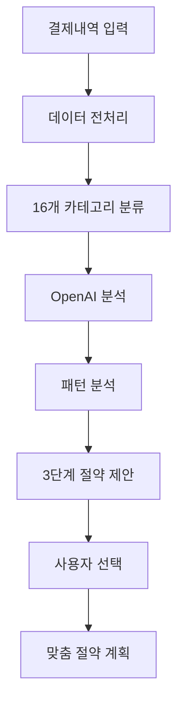

# 💰 FinMate AI

> **개인 결제내역 분석과 맞춤형 절약 제안을 제공하는 AI 기반 금융 분석 서비스**

[](https://python.org)
[](https://fastapi.tiangolo.com)
[](https://openai.com)

---

## 🎯 프로젝트 개요

FinMate AI는 개인의 결제내역을 **16개 카테고리**로 분석하고, **3단계 맞춤형 절약 제안**을 제공하는 스마트 금융 분석 도구입니다. 사용자는 자신의 상황에 맞는 절약 수준을 선택하여 체계적으로 지출을 관리할 수 있습니다.

### 🌟 핵심 가치
- **개인화된 분석**: 16개 세분화된 카테고리별 소비 패턴 분석
- **선택의 자유**: 3단계 절약 레벨로 사용자 맞춤 제안
- **실용성**: 구체적인 금액과 실행 방법 제시
- **지능형 AI**: OpenAI GPT-4 기반 고도화된 분석

---

## ✨ 주요 기능

### 📊 **스마트 소비 패턴 분석**

| 분석 항목 | 세부 내용 |
|---------|-----------|
| **16개 카테고리 분석** | 식비, 쇼핑, 카페/간식, 주거/통신 등 상세 분류 |
| **시간대별 패턴** | 평일/주말, 시간대별 소비 특성 분석 |
| **위험 패턴 감지** | 새벽 소비, 고액 결제, 반복 소비 등 |
| **트렌드 분석** | 상승/하락/안정 트렌드 및 예측 |

### 💡 **3단계 절약 제안 시스템**

사용자가 자신의 상황에 맞게 **선택할 수 있는** 3가지 절약 레벨을 제공합니다.

<table>
<tr>
<th width="25%">🔥 강한 절약</th>
<th width="25%">💪 보통 절약</th>
<th width="25%">🌱 약한 절약</th>
<th width="25%">비교</th>
</tr>
<tr>
<td>

**절약률**: 25-40%<br>
**대상**: 고정비 포함<br>
**특징**: 구조적 변화<br>
**난이도**: 상<br>
**효과**: 높음

</td>
<td>

**절약률**: 15-25%<br>
**대상**: 주요 변동비<br>
**특징**: 습관 개선<br>
**난이도**: 중<br>
**효과**: 중간

</td>
<td>

**절약률**: 5-15%<br>
**대상**: 소액 빈번 소비<br>
**특징**: 점진적 변화<br>
**난이도**: 하<br>
**효과**: 낮음

</td>
<td>

📈 **월 100만원 지출 기준**<br>
🔥 **25-40만원 절약**<br>
💪 **15-25만원 절약**<br>
🌱 **5-15만원 절약**

</td>
</tr>
</table>

### 🎯 **절약 제안의 특별함**

| 특징 | 설명 | 예시 |
|-----|------|------|
| **구체적 금액** | 정확한 절약 예상 금액 제시 | "월 81,250원 절약" |
| **실행 방법** | 구체적이고 실현 가능한 방법 | "배달음식을 주 4회→3회로 줄이고 직접 요리" |
| **난이도 표시** | 각 전략의 실행 난이도 | 상/중/하 |
| **우선순위** | 절약 효과가 큰 카테고리부터 | 식비(10점) > 쇼핑(9점) > 카페(8점) |

---

## 🏗️ 시스템 아키텍처



### 📁 **프로젝트 구조**

```
finmate-ai/
├── 📁 core/
│   └── config.py              # 16개 카테고리 & 절약 규칙 설정
├── 📁 services/
│   ├── data_processor.py      # 거래 데이터 전처리 & 카테고리 분류
│   ├── openai_service.py      # OpenAI GPT-4 연동 & 분석
│   └── saving_service.py      # 3단계 절약 제안 생성 엔진
├── 📁 routers/
│   └── transactions.py        # RESTful API 엔드포인트
├── 📁 schemas/
│   └── transactions.py        # 데이터 모델 & 응답 스키마
├── 🔧 main.py                 # FastAPI 앱 실행
├── 📋 requirements.txt        # 의존성 패키지
└── 📖 README.md              # 프로젝트 문서
```

---

## 🚀 빠른 시작하기

### 1️⃣ **환경 준비**

```bash
# 1. 저장소 클론
git clone https://github.com/team-finmate/finmate-ai.git
cd finmate-ai

# 2. 가상환경 생성
python -m venv venv

# 3. 가상환경 활성화
source venv/bin/activate  # macOS/Linux
# venv\Scripts\activate   # Windows

# 4. 패키지 설치
pip install -r requirements.txt
```

### 2️⃣ **환경변수 설정**

`.env` 파일을 생성하고 OpenAI API 키를 설정합니다:

```env
OPENAI_API_KEY=your_openai_api_key_here
```

### 3️⃣ **서버 실행**

```bash
uvicorn main:app --reload
```

서버가 실행되면 `http://localhost:8000`에서 API를 사용할 수 있습니다.

### 4️⃣ **API 문서 확인**

- **Swagger UI**: http://localhost:8000/docs
- **ReDoc**: http://localhost:8000/redoc

---

## 📡 API 사용법

### **분석 요청**

```http
POST /transactions/analyze/
Content-Type: application/json

[
  {
    "transaction_id": "txn_001",
    "date": "2024-01-15",
    "time": "12:30",
    "merchant": "스타벅스 강남점",
    "category": "카페/간식",
    "amount": 5500,
    "payment_method": "카드",
    "balance": 1500000
  }
]
```

### **응답 예시**

<details>
<summary>📋 <strong>전체 응답 보기</strong></summary>

```json
{
  "total_spent": 900000,
  "category_breakdown": {
    "식비": {
      "amount": 320000,
      "ratio": 0.32,
      "transaction_count": 20,
      "avg_amount": 16000
    },
    "카페/간식": {
      "amount": 150000,
      "ratio": 0.15,
      "transaction_count": 30,
      "avg_amount": 5000
    }
  },
  "spending_trend": "상승",
  "avg_transaction": 12500,
  "top_expenses": [
    {
      "merchant": "배달의민족",
      "amount": 25000,
      "category": "식비"
    }
  ],
  "spending_type": "외식·배달 중심, 주말 지출 집중",
  "risk_patterns": ["새벽 시간대 소비", "고액 단건 결제"],
  "overspending_categories": ["식비", "카페/간식"],
  "saving_suggestions": {
    "강한절약": {
      "level": "🔥 강한 절약",
      "description": "고정비를 포함한 전면적 지출 절약",
      "expected_saving": 225000,
      "reduction_rate": "25-40%",
      "strategies": [
        {
          "category": "식비",
          "current_amount": 320000,
          "target_amount": 240000,
          "saving_amount": 80000,
          "method": "외식/배달을 주 5회에서 3회로 줄이고 직접 요리로 월 80,000원 절약",
          "difficulty": "상"
        }
      ]
    },
    "보통절약": {
      "level": "💪 보통 절약",
      "description": "주요 지출 카테고리 중심 절약",
      "expected_saving": 135000,
      "reduction_rate": "15-25%",
      "strategies": [
        {
          "category": "식비",
          "current_amount": 320000,
          "target_amount": 272000,
          "saving_amount": 48000,
          "method": "외식/배달 주문을 주 1회 줄여서 월 48,000원 절약",
          "difficulty": "중"
        }
      ]
    },
    "약한절약": {
      "level": "🌱 약한 절약",
      "description": "빈번하고 불필요한 소비 점진적 절약",
      "expected_saving": 47000,
      "reduction_rate": "5-15%",
      "strategies": [
        {
          "category": "카페/간식",
          "current_amount": 150000,
          "target_amount": 135000,
          "saving_amount": 15000,
          "method": "간식 구매를 주 1회 줄여서 월 15,000원 절약",
          "difficulty": "하"
        }
      ]
    }
  }
}
```

</details>

---

## 📊 16개 지원 카테고리

<div align="center">

| 순위 | 카테고리 | 절약 우선순위 | 주요 키워드 |
|:---:|---------|:----------:|-----------|
| 🥇 | **식비** | ⭐⭐⭐⭐⭐ | 배달의민족, 맥도날드, 김밥천국 |
| 🥈 | **쇼핑** | ⭐⭐⭐⭐⭐ | 쿠팡, 11번가, 무신사 |
| 🥉 | **카페/간식** | ⭐⭐⭐⭐ | 스타벅스, 이디야, 베이커리 |
| 4 | **취미/여가** | ⭐⭐⭐⭐ | CGV, PC방, 노래방 |
| 5 | **술/유흥** | ⭐⭐⭐ | 소주, 클럽, 치킨 |
| 6 | **편의점/마트/잡화** | ⭐⭐⭐ | CU, 이마트, 다이소 |
| 7 | **주거/통신** | ⭐⭐ | 넷플릭스, SK텔레콤, 전기료 |
| 8 | **교통/자동차** | ⭐⭐ | 카카오택시, 주유, 지하철 |
| 9 | **생활** | ⭐⭐ | 세탁소, 택배, 은행 |
| 10 | **미용** | ⭐⭐ | 미용실, 네일, 화장품 |
| 11 | **여행/숙박** | ⭐ | 항공, 호텔, 에어비앤비 |
| 12 | **의료/건강/피트니스** | ⭐ | 병원, 헬스장, 요가 |
| 13 | **교육** | ⭐ | 학원, 온라인강의, 세미나 |
| 14 | **보험/세금/기타금융** | ➖ | 보험, 국민연금, 증권 |
| 15 | **이체** | ➖ | 송금, 계좌이체, ATM |
| 16 | **카테고리 없음** | ➖ | 분류되지 않은 항목 |

</div>

> **⭐ 우선순위 설명**: 높을수록 절약 효과가 크며, ➖ 표시는 절약 제안에서 제외되는 카테고리입니다.

---

## 🧪 테스트 실행

프로젝트에는 다양한 테스트 파일이 포함되어 있습니다:

```bash
# 16개 카테고리 절약 제안 테스트
python test_16_categories.py

# 통합 시스템 테스트
python test_saving_integration.py
```

---

## 🤝 기여하기

1. 이 저장소를 Fork 합니다
2. 새로운 브랜치를 만듭니다 (`git checkout -b feature/amazing-feature`)
3. 변경사항을 커밋합니다 (`git commit -m 'Add some amazing feature'`)
4. 브랜치에 Push 합니다 (`git push origin feature/amazing-feature`)
5. Pull Request를 생성합니다

---

## 📞 지원 및 문의

- **Issues**: [GitHub Issues](https://github.com/team-finmate/finmate-ai/issues)
- **Discussions**: [GitHub Discussions](https://github.com/team-finmate/finmate-ai/discussions)
- **Email**: [team-finmate@example.com](mailto:team-finmate@example.com)

---

## 📄 라이선스

이 프로젝트는 **MIT 라이선스**를 따릅니다. 자세한 내용은 [LICENSE](LICENSE) 파일을 참조하세요.

---

<div align="center">

**💰 FinMate AI로 스마트한 가계부 관리를 시작하세요! 💰**

[](https://github.com/team-finmate/finmate-ai)
[](https://github.com/team-finmate/finmate-ai)
[](https://github.com/team-finmate/finmate-ai)

</div>